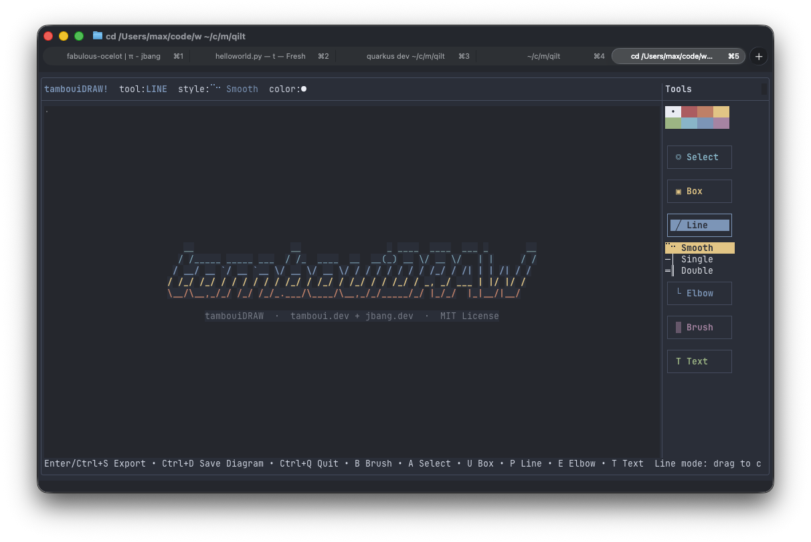

# tamboui-draw

A terminal-native diagramming app built with Java 26, [Tamboui](https://tamboui.dev), and [JBang](https://www.jbang.dev).



Ported from [termDRAW](https://github.com/nicholasgasior/termdraw) — the original TypeScript/Bun/[OpenTUI](https://github.com/nicholasgasior/opentui) implementation by [Nicholas Gasior](https://github.com/nicholasgasior).

## Features

- **5 drawing tools**: Box, Line, Elbow, Paint, Text
- **Smart box borders** with automatic corner/junction joining
- **Braille sub-cell rendering** for smooth diagonal lines
- **Full mouse support** — click, drag, resize, marquee select
- **Undo/redo** with 100-step history
- **JSON document format** compatible with the original termDRAW
- **Nord color theme**

## Requirements

- Java 26+ (with preview features)
- [JBang](https://www.jbang.dev/) installed

## Run

```bash
jbang tambouidraw@maxandersen/tamboui-draw
```

Or from a local clone:

```bash
git clone https://github.com/maxandersen/tamboui-draw.git
cd tamboui-draw
jbang TambouiDraw.java
```

## Keys

| Key | Action |
|-----|--------|
| `a` | Select tool |
| `u` | Box tool |
| `p` | Line tool |
| `e` | Elbow tool |
| `b` | Paint/Brush tool |
| `t` | Text tool |
| `[` / `]` | Cycle style (box/line/brush/border) |
| `{` / `}` | Cycle ink color |
| `Ctrl+Z` | Undo |
| `Ctrl+Y` / `Ctrl+Shift+Z` | Redo |
| `Enter` / `Ctrl+S` | Export art to stdout and quit |
| `Ctrl+D` | Save diagram (.termdraw JSON) |
| `Ctrl+Q` / `Ctrl+C` | Quit without output |
| `Tab` | Cycle tool mode |
| `Escape` | Deselect |
| Arrow keys | Move cursor / move selected object |
| `Space` | Stamp brush (paint/line mode) |

## Project Structure

```
TambouiDraw.java    # Main entry, JBang metadata, TuiRunner setup
model/              # DrawObject sealed interface, records, enums
state/              # DrawState, DragState, HitTest
render/             # DrawingCanvas, GridRenderer, BorderGlyphs, BrailleRenderer
input/              # KeyInput
layout/             # ChromeLayout
io/                 # DocumentIO, ExportUtils
test/               # JUnit 5 tests
test-fixtures/      # Sample documents
```

## Credits

- **Original**: [termDRAW](https://github.com/nicholasgasior/termdraw) by [Nicholas Gasior](https://github.com/nicholasgasior) — TypeScript/Bun/OpenTUI
- **TUI framework**: [Tamboui](https://tamboui.dev) — Java terminal UI framework inspired by Ratatui
- **Runner**: [JBang](https://www.jbang.dev) — run Java source files directly
